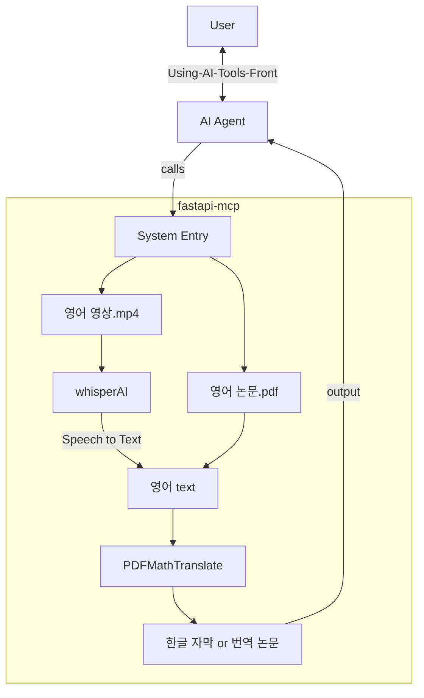

# Using-AI-Tools 
## Front-end
[](https://github.com/daehyun99/Using-AI-Tools-Front)

## Back-end


[](https://github.com/tadata-org/fastapi_mcp)
[](https://github.com/Byaidu/PDFMathTranslate)
[](https://github.com/openai/whisper)


## Diagram


## Documents
- [wiki](http://github.com/daehyun99/Using-AI-Tools/wiki)
- [통합 wiki (v1.0.0)](https://github.com/daehyun99/Translate-app/wiki/Back-end)

## 실행
```sh
uvicorn app.main:app --host 127.0.0.1 --port 8000 --reload
```
